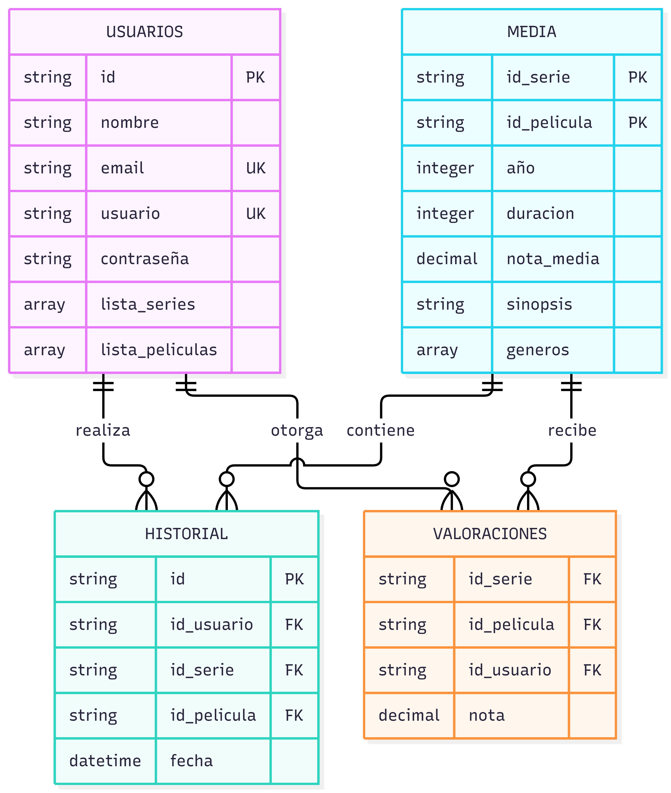

# Practica UT2 01

## 1. Definir el problema y los accesos.

### 1. Escenario elegido
El escenario elegido para la siguiente práctica es la gestión de una plataforma multimedia en el que se gestionaran películas, series, episodios, géneros, usuarios y valoraciones, permitiendo a los usuarios consumir contenido, dejar calificaciones/reseñas y recibir sugerencias personalizadas.

Los tipos de usuarios son:
1. Usuario final: Busca contenido mediante filtros, consulta fichas de series y películas, valora títulos y recibe recomendaciones en su página de inicio.
2. Administrador: Administra la plataforma, gestiona usuarios, gestiona contenido, gestiona reseñas y calificaciones.
3. Motor: Procesa valoraciones e historiales para calcular medias y alimentar los algoritmos de recomendación.

### 2. Preguntas de negocio
La base de datos debe responder a las siguientes preguntas:

1. Realizar una consulta para obtener la información de todos los géneros que el usuario ve frecuentemente.
2. Realizar una consulta para obtener la valoración de las series y películas que el usuario ha visto.
3. Realizar una consulta sobre las valoraciones de las peliculas de un determinado género.
4. Realizar una consulta sobre el año de salida de una serie o película.
5. Realizar una consulta sobre las películas y series que han sido vistas por un usuario.
6. Realizar una consulta sobre las películas que duran más de 2 horas.


### 3. Datos de mayor frecuencia

Los datos de mayor frecuencia de lectura son:
1. Metadatos de catálogo (título, sinopsis, géneros, duración, póster y nota media calculada).
2. Fichas de series con sus temporadas y lista de episodios.
3. Carruseles principales de películas y series.

Los datos de mayor frecuencia de escritura son:
1. Inserción y actualización de valoraciones.
2. Actualización en tiempo real del progreso de visualización.
3. Incremento de la calificación de un título.

### 4. Tabla de relaciones

| Pregunta | Colecciones | Filtros | Ordenación | Paginación |
|----------|------------------------|--------------|--------------|------------|
| 1 | Usuarios y media | Géneros y no visto | Valoraciones | Límite fijo |
| 2 | Historial y valoraciones | Id usuario | Fecha | Scroll infinito |
| 3 | Media | Tipo y género | Valoraciones | Páginas de 20 |
| 4 | Media | Año lanzamiento | Títulos | Páginas de 20 |
| 5 | Historial | ID usuario | Fecha visualización | Scroll infinito |
| 6 | Media | Tipo y duración | Duración | Páginas de 20 |


### 5. Requisitos de seguridad, privacidad, disponibilidad y crecimiento.

1. Autenticación robusta: Los usuarios deben poder registrarse y iniciar sesión en la plataforma.
2. Pseudiminización de identificadores de usuarios: Los usuarios deben poder crear un identificador de usuario único y pseudonimo.
3. Cumplimiento de la RGPD: Los usuarios deben poder darse de baja y darse de alta de la información que proporcionan.


## 2. Diseñar las colecciones.

Imagen del diagrama:



### 1. Colecciones de datos y sus propósitos.
Usuarios: Almacena el perfil del usuario, credenciales seguras, datos anonimizados para cumplir con RGPD, sus listas directas de marcadores (favoritos/"Mi Lista") y preferencias estáticas.

Media: Catálogo único polimórfico de títulos (películas y series). Contiene la metadata descriptiva (géneros, sinopsis, duración/temporadas) y agregaciones precalculadas (nota_media, total_votos) optimizadas para lecturas de alta concurrencia.

Historial: Almacena el log de eventos de consumo cronológico por usuario (reproducciones completas o parciales), desacoplado del documento del usuario para permitir un crecimiento ilimitado en series temporales.

Valoraciones: Registro transaccional de calificaciones numéricas y reseñas individuales asociadas a un par (usuario, media). Permite lecturas filtradas por título o autor sin penalizar el tamaño del catálogo.
### 2. Documentos JSON de las colecciones.

JSON de usuarios:
```json
{
  "_id": {"$oid": "651a1b2c3d4e5f6a7b8c9d01"},
  "pseudonimo_id": "usr_94f8a12e",
  "nombre": "Elena García",
  "usuario": "elena_cine",
  "email": "elena.garcia@example.com",
  "password_hash": "$2b$12$e8Y0N...hashedpassword",
  "estado": "ACTIVO",
  "mi_lista": [
    {"media_id": {"$oid": "651a1b2c3d4e5f6a7b8c9d10"}, "tipo": "PELICULA", "añadido_en": {"$date": "2026-02-14T20:00:00Z"}},
    {"media_id": {"$oid": "651a1b2c3d4e5f6a7b8c9d20"}, "tipo": "SERIE", "añadido_en": {"$date": "2026-03-01T10:15:00Z"}}
  ],
  "preferencias_generos": ["Ciencia Ficción", "Drama"],
  "fecha_registro": {"$date": "2026-01-10T08:30:00Z"},
  "fecha_baja": null
}
```

JSON de media:
```json
{
  "_id": {"$oid": "651a1b2c3d4e5f6a7b8c9d20"},
  "tipo": "SERIE",
  "titulo": "Horizonte Cuántico",
  "sinopsis": "Un grupo de científicos descubre una anomalía gravitatoria.",
  "anio_lanzamiento": 2025,
  "generos": ["Ciencia Ficción", "Suspense"],
  "estado": "PUBLICADO",
  "nota_media": 8.7,
  "total_votos": 1420,
  "temporadas": [
    {
      "numero": 1,
      "episodios": [
        {"numero": 1, "titulo": "Punto de Inflexión", "duracion_min": 52},
        {"numero": 2, "titulo": "Entropía", "duracion_min": 48}
      ]
    }
  ],
  "duracion_min": null,
  "creado_en": {"$date": "2025-11-20T12:00:00Z"}
}
```

JSON de historial:
```json
{
  "_id": {"$oid": "651a1b2c3d4e5f6a7b8c9d30"},
  "usuario_id": {"$oid": "651a1b2c3d4e5f6a7b8c9d01"},
  "media_id": {"$oid": "651a1b2c3d4e5f6a7b8c9d20"},
  "tipo": "SERIE",
  "temporada": 1,
  "episodio": 2,
  "segundos_vistos": 2880,
  "completado": true,
  "fecha_visualizacion": {"$date": "2026-09-28T22:15:30Z"}
}
```

JSON de valoraciones:
```json
{
  "_id": {"$oid": "651a1b2c3d4e5f6a7b8c9d40"},
  "media_id": {"$oid": "651a1b2c3d4e5f6a7b8c9d10"},
  "usuario_id": {"$oid": "651a1b2c3d4e5f6a7b8c9d01"},
  "nota": 9.0,
  "comentario": "Excelente ritmo y banda sonora imponente.",
  "estado": "VISIBLE", 
  "fecha_creacion": {"$date": "2026-09-29T14:20:00Z"}
}
```
### 3. Modelo de incrustación y de referencia.

1- Variantes de películas y series (Incrustación):
El usuario entra en la plataforma y el selector desplegable debe saber que películas y series son las opciones disponibles.

2- Valoraciones (Referencia):
Los usuarios pueden poner reseñas a muchas series y películas, por lo que no es necesario guardar todas dentro de un documento.

### 4. Estrategia para identificadores, fechas, estados y campos opcionales.

Identificadores: id_usuario, id_media, id_valoraciones
Fechas: fecha_valoracion, fecha_creacion, fecha_visualizacion
Estados: String de "pendiente", "vista", "en proceso".
Campos opcionales: El campo "comentario" es opcional para valoraciones.

### 5. Límites del modelo.

Evitar arrays infinitos en las valoraciones a las series y películas.
Controlar el tamaño de los campos de texto.


## 3. Implementar Validacón e índices.

### 1. Creación de colecciones con jsonSchema.

1- Usuarios:
```json
db.createCollection("usuarios", {
  validator: {
    $jsonSchema: {
      bsonType: "object",
      required: ["id", "nombre", "email", "usuario", "contraseña", "lista_series", "lista_peliculas"],
      properties: {
        id: { bsonType: "string" },
        nombre: { bsonType: "string" },
        email: { 
          bsonType: "string", 
          pattern: "^[a-zA-Z0-9._%+-]+@[a-zA-Z0-9.-]+\\.[a-zA-Z]{2,}$" 
        },
        usuario: { bsonType: "string" },
        contraseña: { bsonType: "string" },
        lista_series: {
          bsonType: "array",
          items: { bsonType: "string" }
        },
        lista_peliculas: {
          bsonType: "array",
          items: { bsonType: "string" }
        }
      }
    }
  }
});
```

2- Media:
```json
db.createCollection("media", {
  validator: {
    $jsonSchema: {
      bsonType: "object",
      required: ["año", "duracion", "nota_media", "sinopsis", "generos"],
      properties: {
        id_serie: { bsonType: ["string", "null"] },
        id_pelicula: { bsonType: ["string", "null"] },
        año: { bsonType: "int", minimum: 1888 },
        duracion: { bsonType: "int", minimum: 0 },
        nota_media: { bsonType: ["double", "decimal"], minimum: 0, maximum: 10 },
        sinopsis: { bsonType: "string" },
        generos: {
          bsonType: "array",
          minItems: 1,
          items: { bsonType: "string" }
        }
      }
    }
  }
});
```

3- Historial:
```json
db.createCollection("historial", {
  validator: {
    $jsonSchema: {
      bsonType: "object",
      required: ["id", "usuario_id", "media_id", "tipo", "temporada", "episodio", "segundos_vistos", "completado", "fecha_visualizacion"],
      properties: {
        id: { bsonType: "string" },
        usuario_id: { bsonType: "string" },
        media_id: { bsonType: "string" },
        tipo: { bsonType: "string" },
        temporada: { bsonType: "number" },
        episodio: { bsonType: "number" },
        segundos_vistos: { bsonType: "number" },
        completado: { bsonType: "bool" },
        fecha_visualizacion: { bsonType: "date" }
      }
    }
  }
});
```

4- Valoraciones:
```json
db.createCollection("valoraciones", {
  validator: {
    $jsonSchema: {
      bsonType: "object",
      required: ["id", "media_id", "usuario_id", "nota", "estado", "fecha_creacion"],
      properties: {
        id: { bsonType: "string" },
        media_id: { bsonType: "string" },
        usuario_id: { bsonType: "string" },
        nota: { bsonType: "number" },
        estado: { bsonType: "string" },
        fecha_creacion: { bsonType: "date" }
      }
    }
  }
});
```

### Prueba de rechazo
```json
db.media.insertOne({
  "id_serie": "123456789",
  "id_pelicula": "987654321",
  "año": 2025,
  "duracion": -100,
  "nota_media": 8.7,
  "sinopsis": "Un grupo de científicos descubre una anomalía gravitatoria.",
  "generos": ["Ciencia Ficción", "Suspense"]
});
```

Resultado: MongoDB bloquea la operación porque la duración es negativa.

### 2. Creación de índices.

```json
db.media.createIndex(
  { generos: 1, nota_media: -1, año: -1 },
  { name: "idx_media_genero_nota_año" }
);
```
```json
db.media.createIndex(
  { sinopsis: "text" },
  { name: "idx_media_texto_sinopsis", default_language: "spanish" }
);
```
```json
db.valoraciones.createIndex(
  { media_id: 1,fecha_creacion: -1},
  { name: "idx_valoraciones_media_fecha" }
);
```

### 3. Justificación de índices.

1- idx_media_genero_nota_año: Índice de búsqueda por género, nota y año.
Filtra por igualdad en genero y nota, los entrega ordenados por año.

2- idx_media_texto_sinopsis: Índice de búsqueda por texto en la sinopsis.

3- idx_valoraciones_media_fecha: Índice de búsqueda por media y fecha de creación.

### 4. Evidencia de rendimiento.
```json
db.media.find({"generos": "Ciencia Ficción", "duracion": 120}).sort({"año": -1}).explain("executionStats")
```

## 4. Resolver consultas y agregación compleja.

### 1. Operaciones CRUD.

```json
db.media.insertOne({
  id_serie: "ser_003",
  id_pelicula: null,
  año: 2011
  duracion: 300,
  nota_media: 9.8,
  sinopsis:"Lucha por el trono de hierro en Poniente.",
  generos: ["ciencia ficcion", "aventura", "fantasia", "drama"]
});


db.media.updateOne(
  {id_serie: "ser_003"}
  {
    $set: { duracion: 5000 }
  }
);

db.media.deleteOne({
  id_serie: "ser_003"
})
```

### 2. Filtros combinados, ordenación y paginación.

db.media.find({
  {generos: "ciencia ficcion", duracion: "300"},
  {nota_media: }
})